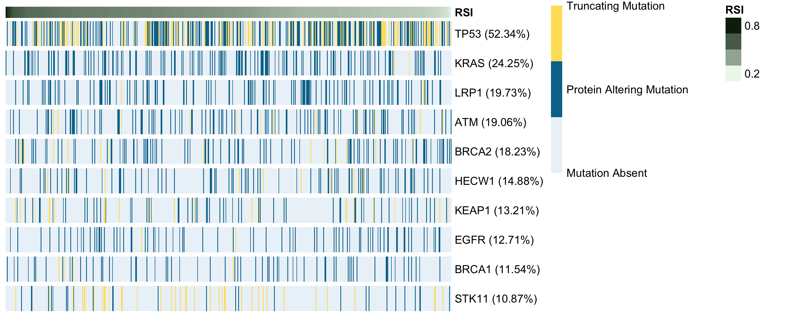

```{r setup, include=FALSE}
knitr::opts_chunk$set(echo = TRUE)
```

# Document Set Up

## Load Packages

```{r import_library, warning=FALSE}

library(here)
library(pheatmap)
library(tidyverse)

```

## Load Data

```{r load_data}

mutation_BM_meta_tbl <- read.csv(here("Data", "mutation_BM_meta_clean.csv"))
mutation_cat_meta_tbl <- read.csv(here("Data", "mutation_cat_meta_clean.csv"))


```


## Select Dataset of Interest

We'll start by taking a subset of genes, which we curated from [Yard et al 2015](https://www.sciencedirect.com/science/article/pii/S1053429615000569?casa_token=2MR_u4AOVPYAAAAA:x7BL4PpC9dX4ib87mUBYsfzCsn1n_duqD1ZE5w1R25s3hrUL5Qqb0ahSONB3k_KOXhrRFl2iSQ). 

```{r select_genes}


all_columns <- colnames(mutation_BM_meta_tbl) 

interest_genes <- c("TP53BP1", "RIF1", "MCM3AP", "SMG1", "SMARCA4",
                    "LRP1", "CIC", "CNTN1", "PIK3CA", "PIK3CB", 
                    "PIK3CD", "HECW1", "KRAS", "KEAP1", "IDH1", "IDH2",
                    "PIK3R1", "PIK3R2", "PIK3R3", "PTEN", "AKT1", "AKT2",
                    "AKT3", "TSC1", "TSC2", "STK11", "ATM", "ATR", "RAD50",
                    "NBN", "CDC25A", "TP53", "MDC1", "BRCA1", "BRCA2", "RAD51",
                    "PRKDC", "EGFR", "BRAF", "ATRX", "AR", "JUN",
                    "STAT1", "RELA", "ABL1", "CDK1", "HDAC1")

mutation_BM_meta_filter <- mutation_BM_meta_tbl %>%
  select("Sample_ID", "RSI", all_of(interest_genes))
row.names(mutation_BM_meta_tbl) <- mutation_BM_meta_filter$Sample_ID

mutation_cat_meta_filter <- mutation_cat_meta_tbl %>%
  select("Sample_ID", "RSI", all_of(interest_genes))
row.names(mutation_cat_meta_tbl) <- mutation_cat_meta_filter$Sample_ID


```


# Plot Dataset

Now, let's see how mutations in these genes relate to the RSI score of each sample. We'll start by first ranking all samples by RSI in a waterfall plot, then create a heatmap based on each sample's mutation status. 

## Distribution of RSI

```{r rsi_histogram}


```


## Waterfall

```{r plot_waterfall}


waterfall.plot <- function(df, value_col){
  # This function will create a waterfall style bar plot using the data from a
  # column, value_col, in df.
  # The x axis will display the labels, row names, from the dataframe.
  # The y axis will display the value for each row in the specified column.
  # The x axis will be ordered based on descending y axis value, creating a
  # the waterfall style.
  # Each plot will be saved as a PNG
  # Format dataset to contain labels as factor ordered by `value_col` value
  df$labels <- row.names(df)
  df <- df %>% arrange(desc(UQ(sym(value_col))))
  df$labels <- factor(df$labels, levels=df$labels)
  # Create Plot
  waterfall <- ggplot(df, 
                      aes(x=labels, 
                      y = UQ(sym(value_col)), 
                      fill = UQ(sym(value_col)))) +
    geom_bar(stat="identity") + 
    scale_fill_gradient(low="#ecf9ec", high="#0d260d") +
    ggtitle(paste("Ranked RSI")) +
    ylab("RSI") +
    xlab("Samples") +
    ylim(0, 1) +
    theme_classic() +
    theme(plot.title = element_text(hjust = 0.5),
          axis.text.x = element_blank(),
          axis.ticks = element_blank(),
          legend.position = "none")
  # Save Plot
  plotDir <- here("Plots")
  dir.create(file.path(plotDir), showWarnings = FALSE)# Create dir if necessary
  filename <- paste0("RSI_Waterfall.png")
  png(file.path(plotDir, filename), width = 1000, height = 600, units = "px", 
      res = 125)
  print(waterfall)
  dev.off()
  return(list(df = df, plot = waterfall))
}

waterfall_BM_results <- waterfall.plot(df = mutation_BM_meta_filter, value_col = "RSI")
ranked_BM_df <- waterfall_BM_results[['df']]
waterfall_BM_plot <- waterfall_BM_results[['plot']]


waterfall_cat_results <- waterfall.plot(df = mutation_cat_meta_filter, value_col = "RSI")
ranked_cat_df <- waterfall_cat_results[['df']]
waterfall_cat_plot <- waterfall_cat_results[['plot']]


```

Let's take a look at the waterfall plot. 

```{r show_waterfall}
print(waterfall_BM_plot)
```


## Heatmap of Mutation Data

Now, we'll create a heatmap of the mutation data for each of the samples included in the RSI waterfall.

```{r mutation_heatmap}

# Assess mutation prevalence using binary matrix dataframe, `ranked_BM_df`. 

mutation_sum_BM_df <- ranked_BM_df %>%
  column_to_rownames("Sample_ID") %>%
  select(!c(labels)) %>%
  rownames_to_column() %>%
    pivot_longer(-rowname, 'variable', 'value') %>%
    pivot_wider(variable, rowname) %>%
  mutate(BM_row_count = rowSums(select(., -variable))) %>%
  mutate(BM_row_perc = BM_row_count/nrow(ranked_BM_df)*100) %>%
  # column_to_rownames("variable") %>%
  select(variable, BM_row_perc)

# Merge prevalence of all mutations into dataframe containing multiple mutation types, `ranked_cat_df`
mutation_sum_cat_df <- ranked_cat_df %>%
  column_to_rownames("Sample_ID") %>%
  select(!c(labels)) %>%
  rownames_to_column() %>%
    pivot_longer(-rowname, 'variable', 'value') %>%
    pivot_wider(variable, rowname) %>%
  inner_join(mutation_sum_BM_df, by="variable") %>%
  mutate(gene_perc = paste0(variable, " (", round(BM_row_perc, 2), "%)")) %>%
  arrange(desc(BM_row_perc)) %>%
  column_to_rownames("gene_perc")

# Get rid of RSI variable for each sample, and remove unnecessary columns. We now have a matrix of mutation status
# 0 = no mutation
# 1 = protein altering mutation (not truncating)
# 2 = truncating mutation
heatmap_all_df <- mutation_sum_cat_df %>%
  filter(variable!="RSI") %>%
  select(!c(variable, BM_row_perc))

# For plotting purposes, we'll also narrow this down to the genes with the highest mutation prevalence in this cohort
heatmap_df_limit10 <- head(heatmap_all_df, 10)

# Build RSI annotation dataframe, with a single column for RSI value and row names are sample IDs
# The row names here must match the column names in the matrix we give to the heatmap function
RSI_var = t(mutation_sum_cat_df[mutation_sum_cat_df$variable=="RSI", 
                                !(colnames(mutation_sum_cat_df) %in% c("variable", "BM_row_perc"))])
annotation_col = data.frame(RSI = RSI_var)
colnames(annotation_col) <- "RSI"
annotation_colors <- list(RSI = c("#f9ecec", "#602020"))
annotation_colors <- list(RSI = c("#ecf9ec", "#0d260d"))

# Heatmap of top 10 genes
pheatmap(heatmap_df_limit10, cluster_rows = FALSE, cluster_cols = FALSE,
         show_colnames = FALSE, width = 10, height = 4,
         color = c("#ecf2f9", "#007399", "#ffe066"), legend_breaks = c(0, 1, 2), 
         legend_labels = c("Mutation Absent", "Protein Altering Mutation", "Truncating Mutation"),
         annotation_col = annotation_col, annotation_colors = annotation_colors, 
         gaps_row = c(seq(1, nrow(heatmap_df_limit10))), filename = here("Plots", "mutation_heatmap_limit10.png")
         )


# Heatmap of all curated genes
pheatmap(heatmap_all_df, cluster_rows = FALSE, cluster_cols = FALSE,
         show_colnames = FALSE, width = 10, height = 7,
         color = c("#ecf2f9", "#007399", "#ffe066"), legend_breaks = c(0, 1, 2), 
         legend_labels = c("Mutation Absent", "Protein Altering Mutation", "Truncating Mutation"),
         annotation_col = annotation_col, annotation_colors = annotation_colors, 
         gaps_row = c(seq(1, nrow(heatmap_all_df))), filename = here("Plots", "mutation_heatmap.pdf")
         )

```

Finally, let's take a look at our heatmaps. 


